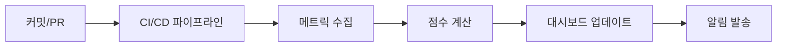

# Avengers 에이전트 평가 기준 (Evaluation Rubrics)

> 전체 에이전트 성과 평가를 위한 종합 가이드

---

## 1. 평가 개요

### 1.1 평가 목적

- 에이전트별 성과를 객관적으로 측정
- 지속적인 품질 개선을 위한 기준선 설정
- 팀 전체의 효율성 및 품질 향상

### 1.2 평가 주기

| 주기 | 평가 범위 | 평가자 |
|------|----------|--------|
| 실시간 | 개별 작업 완료 | 자동화 시스템 |
| 일간 | 일일 KPI | Captain |
| 주간 | 주간 종합 성과 | Captain + 팀 |
| 스프린트/미션별 | 미션 성과 | Captain + Debrief |

---

## 2. 에이전트별 핵심 KPI 요약

### 2.1 Captain (오케스트레이터)

| 영역 | 핵심 KPI | 목표값 | 가중치 |
|------|----------|--------|--------|
| 작업 분배 | 에이전트-작업 적합도 | >= 95% | 25% |
| 작업 분배 | 재할당률 | <= 5% | 15% |
| 조율 | 병렬 작업 비율 | >= 80% | 20% |
| 조율 | 충돌 발생률 | <= 5% | 15% |
| 의사결정 | 요구사항 커버리지 | >= 95% | 15% |
| 관리 | 미션 완료율 | >= 95% | 10% |

### 2.2 IronMan (풀스택 개발자)

| 영역 | 핵심 KPI | 목표값 | 가중치 |
|------|----------|--------|--------|
| 코드 품질 | 린트 오류 | 0 | 15% |
| 코드 품질 | 코드 복잡도 | <= 10 | 10% |
| 테스트 | 라인 커버리지 | >= 80% | 20% |
| 테스트 | 신규 코드 커버리지 | >= 90% | 15% |
| 빌드 | 빌드 성공률 | >= 98% | 15% |
| 성능 | Lighthouse 점수 | >= 90 | 15% |
| TDD | TDD 사이클 준수율 | >= 90% | 10% |

### 2.3 Natasha (백엔드 개발자)

| 영역 | 핵심 KPI | 목표값 | 가중치 |
|------|----------|--------|--------|
| API | 응답 정확도 | >= 99% | 20% |
| API | P95 응답 시간 | <= 500ms | 10% |
| 데이터 | 트랜잭션 무결성 | 100% | 20% |
| 데이터 | N+1 쿼리 발생률 | 0% | 10% |
| 보안 | Critical 취약점 | 0 | 20% |
| 보안 | SQL Injection 방어율 | 100% | 10% |
| TDD | TDD 사이클 준수율 | >= 90% | 10% |

### 2.4 Groot (테스트 전문가)

| 영역 | 핵심 KPI | 목표값 | 가중치 |
|------|----------|--------|--------|
| 커버리지 | 라인 커버리지 | >= 85% | 20% |
| 커버리지 | 브랜치 커버리지 | >= 80% | 15% |
| 안정성 | 플레이키 테스트 수 | 0 | 25% |
| 결함 감지 | 테스트 결함 감지율 | >= 90% | 20% |
| 결함 감지 | 프로덕션 결함 유출률 | <= 5% | 10% |
| TDD | TDD 사이클 준수율 | >= 95% | 10% |

---

## 3. 성과 등급 기준 (Performance Grading)

### 3.1 등급 정의

| 등급 | 점수 범위 | 설명 |
|------|----------|------|
| **S (Exceptional)** | 95-100 | 모든 목표 초과 달성, 모범 사례 |
| **A (Excellent)** | 85-94 | 대부분 목표 달성, 우수한 성과 |
| **B (Good)** | 75-84 | 핵심 목표 달성, 양호한 성과 |
| **C (Acceptable)** | 65-74 | 최소 기준 충족, 개선 필요 |
| **D (Below Standard)** | 50-64 | 기준 미달, 즉시 개선 필요 |
| **F (Critical)** | < 50 | 심각한 문제, 긴급 조치 필요 |

### 3.2 점수 계산 방법

```
에이전트 점수 = Σ (개별 KPI 달성률 × 가중치)

개별 KPI 달성률 = min(100, (실제값 / 목표값) × 100)
                  또는
                  max(0, (1 - (실제값 / 목표값)) × 100)  // 낮을수록 좋은 지표
```

### 3.3 예시 계산

```
IronMan 주간 점수 계산:
- 린트 오류: 0 (목표 0) → 100% × 0.15 = 15
- 코드 복잡도: 8 (목표 10) → 100% × 0.10 = 10
- 라인 커버리지: 82% (목표 80%) → 100% × 0.20 = 20
- 신규 코드 커버리지: 88% (목표 90%) → 97.8% × 0.15 = 14.67
- 빌드 성공률: 99% (목표 98%) → 100% × 0.15 = 15
- Lighthouse 점수: 88 (목표 90) → 97.8% × 0.15 = 14.67
- TDD 준수율: 85% (목표 90%) → 94.4% × 0.10 = 9.44

총점: 98.78 → 등급 S
```

---

## 4. 평가 프로세스

### 4.1 자동 평가 (Automated Evaluation)



**자동 수집 메트릭:**
- 테스트 커버리지 (Jest/Istanbul)
- 린트 결과 (ESLint/TSLint)
- 빌드 성공/실패 (CI)
- 번들 크기 (webpack-bundle-analyzer)
- 성능 점수 (Lighthouse CI)
- 보안 스캔 (npm audit, Snyk)

### 4.2 수동 평가 (Manual Evaluation)

| 평가 항목 | 평가자 | 주기 | 방법 |
|----------|--------|------|------|
| 코드 리뷰 품질 | 동료 에이전트 | PR당 | Code Review Skill |
| 협업 효과성 | Captain | 주간 | 관찰 및 피드백 |
| 문서화 품질 | Vision | 필요시 | 문서 검토 |
| 설계 품질 | Dr.Strange | 미션별 | 설계 리뷰 |

---

## 5. 개선 프로세스

### 5.1 성과 개선 흐름

```
지표 하락 감지 → 원인 분석 → 개선 계획 수립 → 실행 → 검증
```

### 5.2 등급별 조치 사항

| 등급 | 조치 사항 | 담당 |
|------|----------|------|
| S-A | 모범 사례 공유, 칭찬 | Captain |
| B | 정상 진행, 선택적 개선 | 해당 에이전트 |
| C | 개선 계획 수립 필수 | Captain + 해당 에이전트 |
| D | 즉시 개선 조치, 멘토링 | Captain + 팀 |
| F | 작업 중단, 긴급 대응 | 전체 팀 |

### 5.3 개선 액션 템플릿

```markdown
## 개선 액션 계획

**에이전트:** [에이전트명]
**현재 등급:** [등급]
**문제 지표:** [지표명: 현재값 / 목표값]

### 원인 분석
- [ ] 기술적 원인
- [ ] 프로세스 원인
- [ ] 리소스 원인

### 개선 조치
1. [단기 조치 - 1주 내]
2. [중기 조치 - 2주 내]
3. [장기 조치 - 1개월 내]

### 목표
- **1주 후 목표:** [값]
- **2주 후 목표:** [값]
- **최종 목표:** [목표값]

### 검증 방법
- [측정 방법]
- [확인 주기]
```

---

## 6. 팀 전체 성과 지표

### 6.1 팀 KPI

| 지표 | 설명 | 목표값 |
|------|------|--------|
| 미션 성공률 | 완료된 미션 비율 | >= 95% |
| 평균 미션 소요 시간 | 예상 대비 실제 시간 비율 | <= 110% |
| 팀 평균 등급 | 전체 에이전트 평균 점수 | >= B (75점) |
| Critical 이슈 발생률 | 프로덕션 Critical 이슈 비율 | <= 1% |
| 기술 부채 증가율 | 스프린트당 기술 부채 증가 | <= 5% |

### 6.2 팀 시너지 지표

| 지표 | 설명 | 목표값 |
|------|------|--------|
| 병렬 작업 효율 | 동시 작업 완료율 | >= 85% |
| 충돌 해결 시간 | 평균 충돌 해결 시간 | <= 30분 |
| 코드 리뷰 응답 시간 | 리뷰 요청 후 첫 응답까지 시간 | <= 2시간 |
| 지식 공유 빈도 | 팀 내 지식 공유 횟수 | >= 2회/주 |

---

## 7. 리포팅 템플릿

### 7.1 일일 성과 리포트

```markdown
# 일일 성과 리포트 - YYYY-MM-DD

## 팀 요약
- 전체 완료 작업: X건
- 진행 중 작업: Y건
- 블로커: Z건

## 에이전트별 현황

### Captain
- 할당 작업: X건
- 병렬화 효율: XX%
- 이슈: [있으면 기재]

### IronMan
- 완료 작업: X건
- 커버리지: XX%
- 빌드 상태: 성공/실패

### Natasha
- 완료 작업: X건
- API 응답 시간: XXXms
- 보안 이슈: 0건

### Groot
- 실행 테스트: X건
- 통과율: XX%
- 플레이키: 0건

## 내일 계획
- [계획 1]
- [계획 2]
```

### 7.2 주간 성과 리포트

```markdown
# 주간 성과 리포트 - YYYY-WXX

## 주간 요약
| 지표 | 목표 | 실제 | 달성률 |
|------|------|------|--------|
| 완료 작업 | X | Y | Z% |
| 미션 성공률 | 95% | X% | - |
| 팀 평균 점수 | 75 | X | - |

## 에이전트별 성과

| 에이전트 | 점수 | 등급 | 전주 대비 |
|----------|------|------|----------|
| Captain | XX | X | +/-X |
| IronMan | XX | X | +/-X |
| Natasha | XX | X | +/-X |
| Groot | XX | X | +/-X |

## 개선 필요 영역
1. [영역 1]: [현황] → [목표]
2. [영역 2]: [현황] → [목표]

## 다음 주 목표
- [목표 1]
- [목표 2]
```

---

## 8. 참고 자료

### 8.1 관련 문서
- `captain-metrics.md` - Captain 상세 메트릭
- `ironman-metrics.md` - IronMan 상세 메트릭
- `natasha-metrics.md` - Natasha 상세 메트릭
- `groot-metrics.md` - Groot 상세 메트릭

### 8.2 도구 및 자동화
- **CI/CD:** GitHub Actions
- **커버리지:** Jest + Istanbul
- **린트:** ESLint
- **성능:** Lighthouse CI
- **보안:** npm audit, Snyk
- **모니터링:** 대시보드 (TBD)

---

## 변경 이력

| 날짜 | 버전 | 변경 내용 | 작성자 |
|------|------|----------|--------|
| 2024-XX-XX | 1.0 | 초기 버전 작성 | Dr.Strange |
